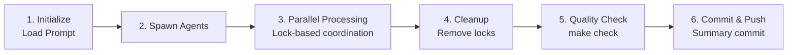

# Subagent Swarm Documentation Review System

This system enables parallel documentation review using multiple subagents with lock-based coordination.

## Overview

The system consists of three main components:

1. **`.subagent_prompt.md`** - The review prompt with instructions
2. **`subagent_worker.py`** - Individual subagent worker script
3. **`subagent_coordinator.py`** - Coordinator that spawns and manages subagents
4. **`launch_review_swarm.sh`** - Shell launcher script

## The Review Prompt

The prompt file (`.subagent_prompt.md`) contains comprehensive instructions for documentation review:

- **Role**: Expert Python core contributor
- **Focus**: Time and space complexity verification
- **Objective**: Ensure correctness, clarity, and conciseness
- **Checklist**: Complexity claims, examples, best practices, structure
- **Rules**: What to edit, what to delete, success criteria

### Key Instructions

Each subagent will:
1. Verify every complexity claim against Python implementation
2. Delete generic or unrelated documentation
3. Keep only performance-focused examples
4. Ensure all caveats are documented (amortized, worst case, etc.)
5. Commit changes with clear messages

### Example Deletions

**DELETE (too generic):**
```python
x = [1, 2, 3]
y = len(x)
print(y)
```

**KEEP (demonstrates complexity):**
```python
# dict vs list for lookup - O(1) vs O(n)
users_dict = {1: 'Alice', 2: 'Bob'}      # O(1) lookup
user = users_dict[1]                      # O(1)

users_list = [(1, 'Alice'), (2, 'Bob')]   # O(n) lookup
user = next(u for u in users_list if u[0] == 1)  # O(n)
```

## Coordination: Lock File Pattern

**Race Condition Prevention:**

Each subagent:
1. Tries to acquire lock: `docs/.locks/{filename}.lock`
2. If lock exists → skip file (another agent has it)
3. If lock acquired → process file
4. Edit and commit changes
5. Release lock

**Lock File Content:**
```
agent-2
2024-01-16T10:30:45.123456
```

**No External Dependencies:** Uses only filesystem operations and git.

## How to Use

### Option 1: Shell Launcher (Recommended)

```bash
# Default: 4 agents
./launch_review_swarm.sh

# Custom number of agents
./launch_review_swarm.sh 8
```

### Option 2: Python Coordinator Directly

```bash
# Default: 4 agents
python subagent_coordinator.py

# Custom number of agents
python subagent_coordinator.py --agents 8

# Dry run (see what would happen)
python subagent_coordinator.py --agents 4 --dryrun
```

### Option 3: Manual Subagent Spawning

```bash
# Load prompt into environment
export REVIEW_PROMPT=$(cat .subagent_prompt.md)
export LOCK_DIR="docs/.locks"

# Spawn 4 agents in parallel
for i in {1..4}; do
    SUBAGENT_ID="agent-$i" python subagent_worker.py &
done

# Wait for all to complete
wait

# Run final checks
make check
git add docs/
git commit -m "Review: Documentation review complete"
git push
```

## What Happens

### 1. Initialization
```
✓ Loaded prompt (3245 bytes)
✓ Initialized progress tracking (345 files)

============================================================
Spawning 4 subagents
============================================================

✓ Spawned agent-1 (PID: 12345)
✓ Spawned agent-2 (PID: 12346)
✓ Spawned agent-3 (PID: 12347)
✓ Spawned agent-4 (PID: 12348)
```

### 2. Parallel Processing

Each agent independently:
- Scans `docs/` for `.md` files
- For each file:
  - Tries to acquire lock
  - If locked: skip to next file
  - If acquired: process file
  - Release lock

```
[agent-1] Processing: docs/builtins/list.md
  ✓ Has complexity table
  ✓ Has code examples
  ✓ Has best practices
  Size: 4526 bytes
[agent-1] ✓ docs/builtins/list.md

[agent-2] Processing: docs/stdlib/os.md
  (locked by agent-1 or already processed)
  [agent-2] Skipped (locked): docs/stdlib/os.md
```

### 3. Completion

```
============================================================
All subagents completed
============================================================

Progress Report:
  Total files: 345
  Completed:   340 (98.6%)
  In progress: 0
  Failed:      2
  Pending:     3

Running quality checks...
✓ All quality checks passed

Staging changes...
Creating summary commit...
✓ Changes committed
```

## Configuration

### Environment Variables

```bash
# Set by coordinator automatically:
SUBAGENT_ID="agent-1"              # Unique agent identifier
REVIEW_PROMPT="..."                # Full prompt text
LOCK_DIR="docs/.locks"             # Lock file directory
```

### Lock File Location

Default: `docs/.locks/`

Customizable via `LOCK_DIR` environment variable:
```bash
export LOCK_DIR="/tmp/review_locks"
python subagent_worker.py
```

## Progress Tracking

Monitor progress in real-time:

```bash
# Watch progress file
watch -n 2 'python -c "
import json
p = json.loads(open(\".subagent_progress.json\").read())
print(f\"Progress: {len(p.get(\"completed\", []))}/{p.get(\"total_files\")}\")"'
```

Or check lock directory:

```bash
# See which files are being processed
ls -la docs/.locks/

# Count locked files
ls docs/.locks/*.lock 2>/dev/null | wc -l
```

## Error Handling

### File is Locked

If a file is locked longer than expected:
```bash
# Check lock age
stat docs/.locks/list.md.lock

# Manually release stuck lock
rm docs/.locks/list.md.lock

# Subagent will retry on next cycle
```

### Agent Crash

If an agent crashes/times out:
- Lock file remains (prevents reprocessing)
- Other agents continue normally
- Failed file can be manually reviewed

```bash
# Check for failed agents
ls -l docs/.locks/*.lock

# Remove lock if file was only partially processed
rm docs/.locks/problematic.md.lock
```

### Quality Check Failure

If `make check` fails at the end:
```bash
# Review failed checks
make check

# Fix issues manually
git diff

# Re-run checks
make check

# Then commit
git add docs/
git commit -m "Review: Fix quality check issues"
```

## Performance Notes

- **Parallelization**: Near-linear scaling with number of agents (4-8 optimal)
- **Lock Overhead**: Minimal (filesystem atomic writes)
- **Slowest Part**: Likely git commits (sequential)
- **Recommendation**: 4-8 agents for 300+ files

## Workflow



## Testing the System

### Dry Run

```bash
# See what would happen without executing
python subagent_coordinator.py --agents 4 --dryrun
```

### Single Agent Test

```bash
# Test with one agent on small subset
export SUBAGENT_ID="test-1"
export LOCK_DIR="docs/.locks"
python subagent_worker.py
```

### Check Locks Work

```bash
# Verify lock file creation/cleanup
python -c "
from pathlib import Path
from subagent_worker import acquire_lock, release_lock

lock = acquire_lock('docs/test.md')
print(f'Lock acquired: {lock}')
release_lock(lock)
print('Lock released')
"
```

## Troubleshooting

### No agents spawning
- Check Python version (3.8+)
- Verify `subagent_worker.py` exists
- Check permissions: `ls -l subagent_worker.py`

### Agents immediately exit
- Check `.subagent_prompt.md` exists
- Verify `docs/` directory exists with `.md` files
- Check `SUBAGENT_ID` is set

### Locks not cleaning up
- Manually: `rm -rf docs/.locks/*`
- Use: `python subagent_coordinator.py` (cleans up automatically)

### Git commits fail
- Check git is configured: `git config user.email`
- Verify working directory is clean: `git status`

## Advanced Usage

### Custom Prompt per Subagent

Modify `subagent_coordinator.py` to pass different prompts:
```python
for i in range(1, self.num_agents + 1):
    if i % 2 == 0:
        env["REVIEW_PROMPT"] = self.load_prompt("brief")
    else:
        env["REVIEW_PROMPT"] = self.load_prompt("detailed")
```

### Distributed Subagents

Run agents on different machines:
```bash
# Machine 1
SUBAGENT_ID="agent-1" python subagent_worker.py

# Machine 2 (shared filesystem)
SUBAGENT_ID="agent-2" python subagent_worker.py
```

**Note:** Requires shared lock directory (NFS, shared drive, etc.)

## Next Steps

1. **Review the prompt**: `cat .subagent_prompt.md`
2. **Start review**: `./launch_review_swarm.sh`
3. **Monitor progress**: `watch -n 2 'ls docs/.locks/*.lock'`
4. **After completion**: `git log --oneline -n 5`

---

**Questions?** Check `subagent_coordinator.py` and `subagent_worker.py` for implementation details.
